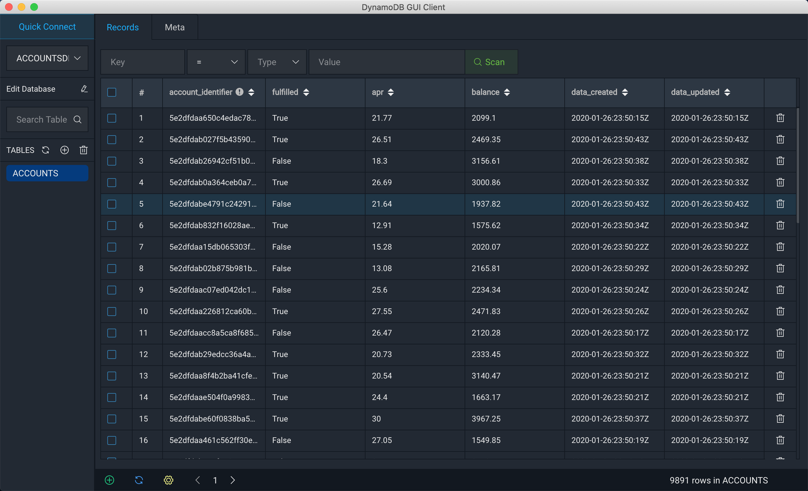

# Local Build

## Requirements

- Python 3.7
- [DynamoDb-GUI-Client](https://github.com/Arattian/DynamoDb-GUI-Client)

### [Local DynamoDB Setup](https://docs.aws.amazon.com/amazondynamodb/latest/developerguide/DynamoDBLocal.html)

#### To start dynamoDB locally

Run `aws configure` or your securityScripts for authentication, required for local dynamo

```
mkdir dynamo

cd dynmo

wget https://s3.ap-south-1.amazonaws.com/dynamodb-local-mumbai/dynamodb_local_latest.tar.gz

tar -xzf dynamodb_local_latest.tar.gz

alias start-dynamo="java -Djava.library.path=<ABSOLUTE_PATH>/dynamo/DynamoDBLocal_lib -jar /Users/Riad/codespace/dynamo/DynamoDBLocal.jar -sharedDb"

start-dynamo
```

## Local Setup Environment

```
brew install sonarqube
brew install sonar-scanner
```

## Setup Local Python Virtual Environment

```
python -m venv test_env
chmod +x test_env/bin/activate
source ./test_env/bin/activate
pip install --upgrade pip
pip install -r requirements.txt
```

## Start Local Sonar Scan

```
alias sonar='/usr/local/Cellar/sonarqube/8.1.0.31237/bin/sonar'
sonar start|stop|restart
```

## Run cmd

```
$ python run.py
```

## Expected STDOUT

```created table ACCOUNTS.
............................................................................................................................................................................................................................................................................................................................................................................................................Finished inserting "9891" records
```

## DynamoDB GUI




